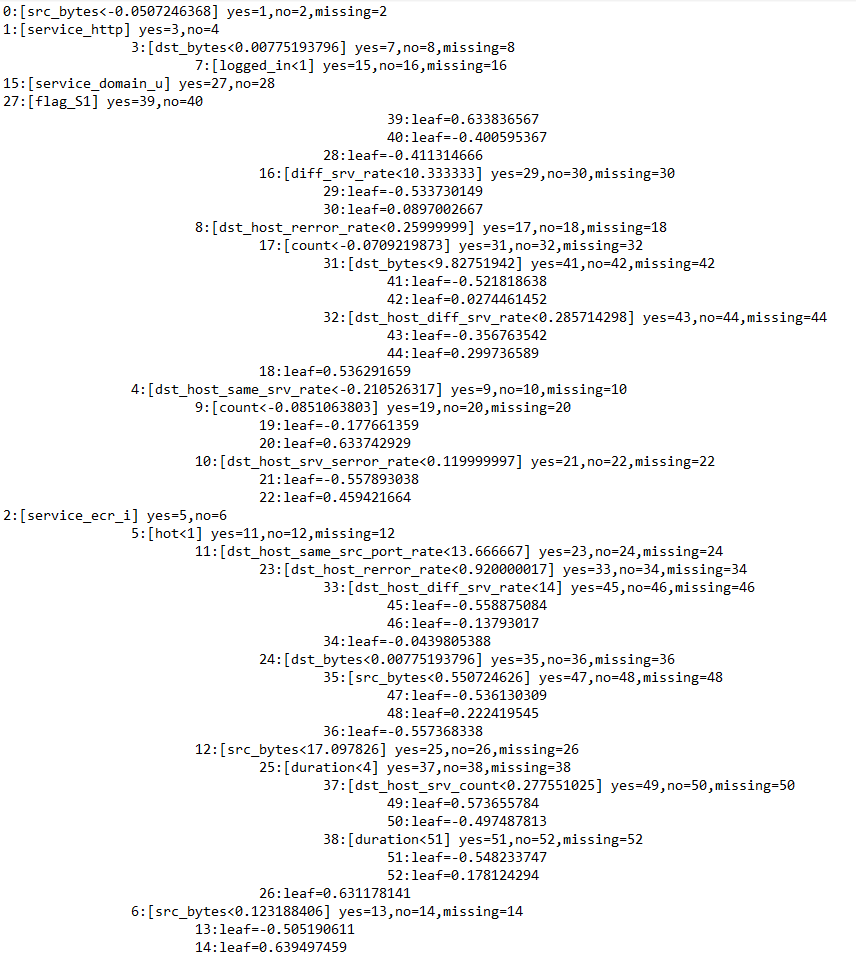

1. Любые данные - XgBoost, LightGBM, CatBooost - бинарная классификация, формула итог

Данные - NSL-KDD (нормальный и атакующий трафик), Бинарная классификация с помощью XgBoost.

Весовые коэффициенты признаков:
(./pictures/weights.png)

Дерево решений:
