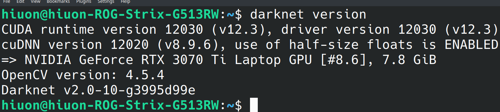
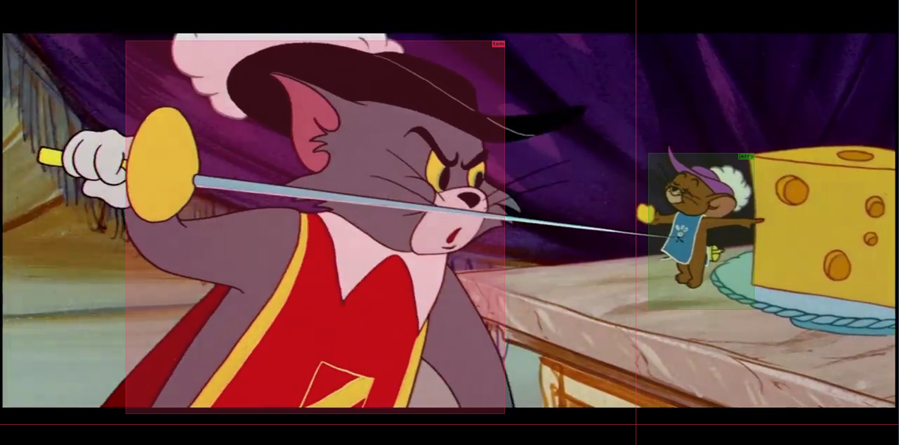
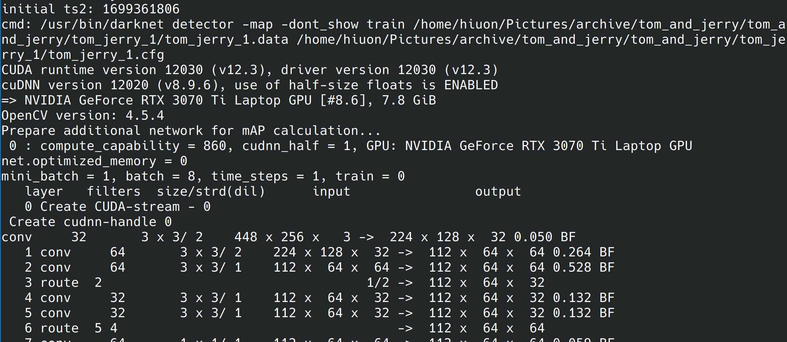
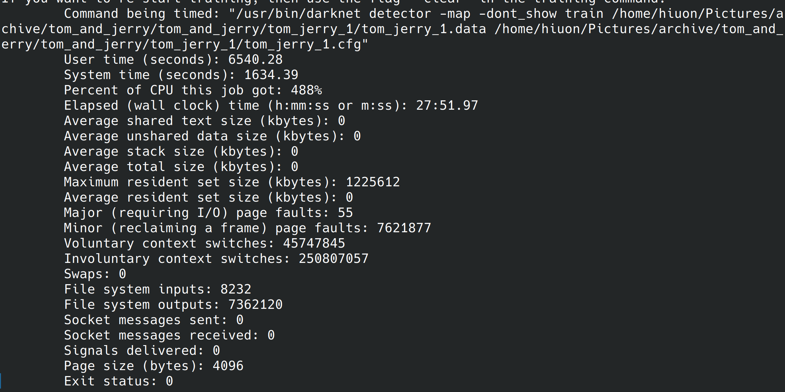
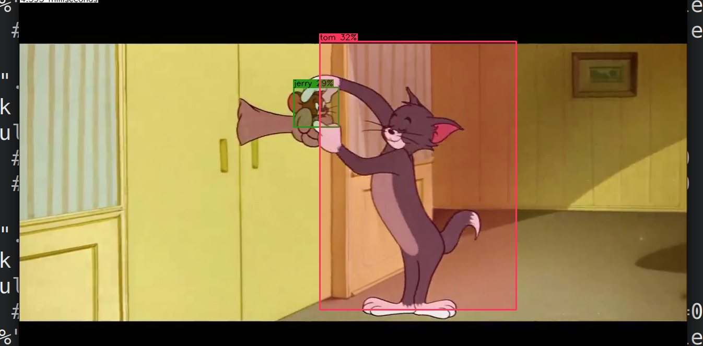
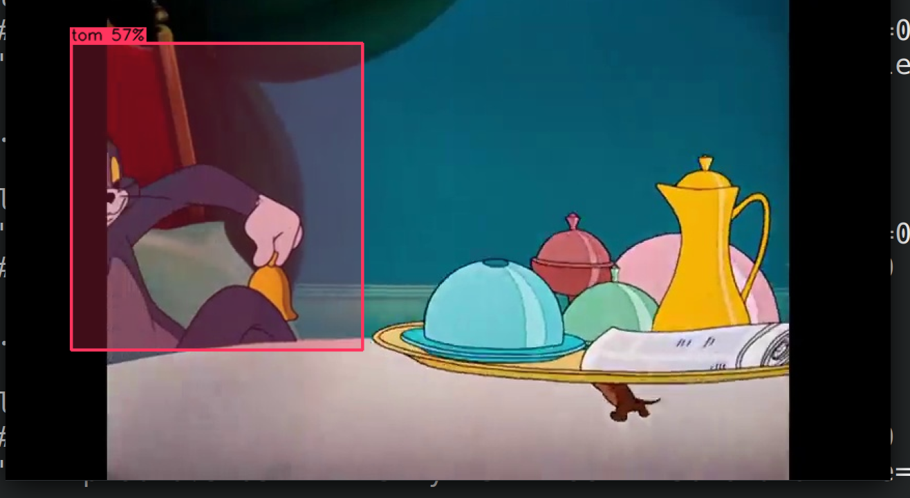
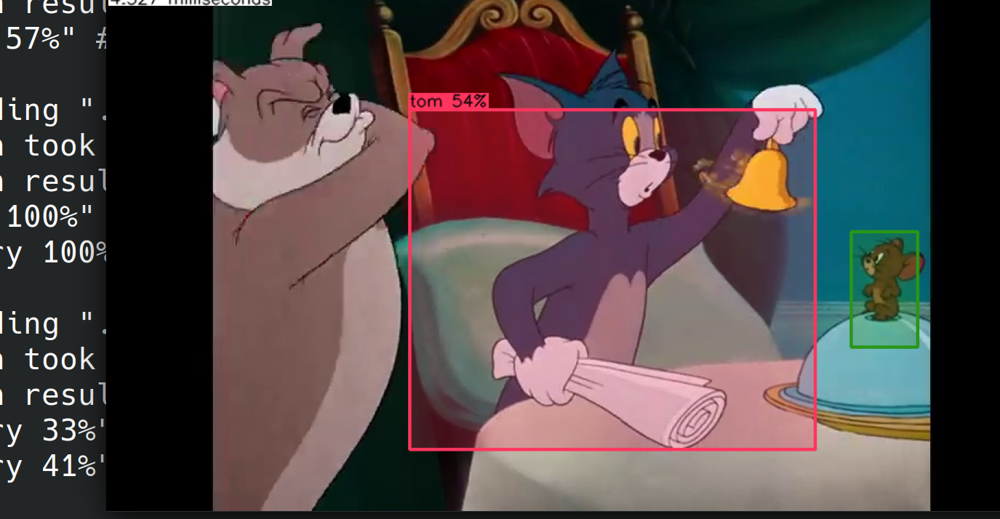
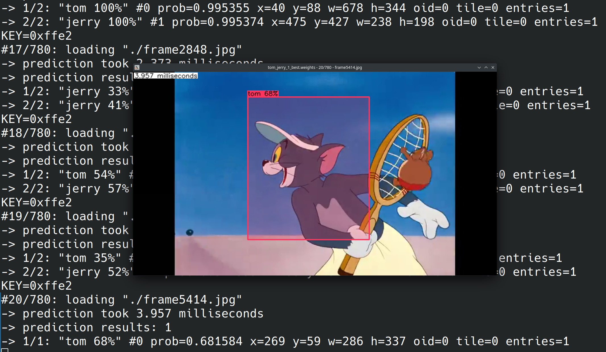

2. Yolo - развернуть, посмотреть картинки, отчет по использованию

### Использовал данную реализацию: https://github.com/hank-ai/darknet
---
### Далее был долгий процесс установки darknet и всех зависимостей (для работы на GPU с использованием различных библиотек от nvidia):

---
### Я решил попробовать определять на картинках где Том, а где Джерри из Тома и Джерри. Набор картинок нашел [тут](https://www.kaggle.com/datasets/balabaskar/tom-and-jerry-image-classification). С помощью дополнительных инструментов разметил несколько десятков картинок:

---
### После разметки, начал процесс обучения (заняло некторое время):

---
### После, используя данные обучения проверил детектор на других картинках:

---
### Уже как-то может определять тестируемые объекты:).